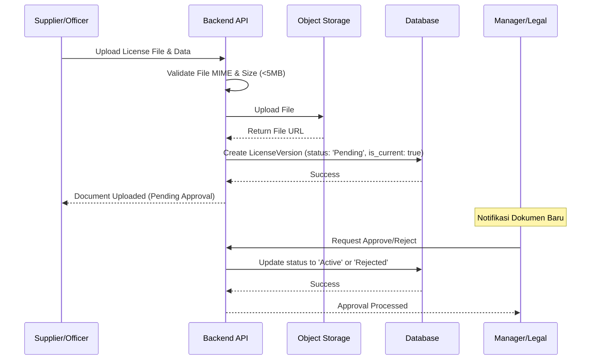

Sebagai Senior Technical Architect, saya akan menerjemahkan PRD, User Stories, dan Analisis QA tersebut ke dalam **Low-Level Design (LLD)** yang mendetail. Dokumen ini akan menjadi panduan teknis bagi tim pengembang untuk mengimplementasikan sistem secara presisi.

---

# 🏗️ Technical Design Document: Supplier License Management System (SLMS)

## 1. Arsitektur Data (Database Schema)

Sistem ini akan menggunakan database relasional (PostgreSQL) untuk menjaga integritas data dan mendukung transaksi ACID, terutama pada proses *versioning* dokumen dan *approval workflow*.

### 1.1 Entity Relationship Diagram (ERD) Logic
- **Suppliers** (1) $\rightarrow$ (N) **Licenses**
- **Licenses** (1) $\rightarrow$ (N) **LicenseVersions**
- **Users** (1) $\rightarrow$ (1) **Suppliers** (Opsional, hanya untuk Supplier Portal)
- **LicenseVersions** (1) $\rightarrow$ (N) **NotificationLogs**

### 1.2 Kamus Data (Data Dictionary)

#### Table: `suppliers`
Menyimpan informasi dasar entitas pemasok.
| Field | Type | Constraints | Description |
| :--- | :--- | :--- | :--- |
| `supplier_id` | UUID | PK, Unique | Identifier unik supplier. |
| `company_name` | VARCHAR(255)| Not Null, Indexed| Nama resmi perusahaan. |
| `address` | TEXT | Not Null | Alamat lengkap. |
| `contact_person`| VARCHAR(100) | Not Null | Nama narahubung. |
| `contact_email` | VARCHAR(100) | Not Null, Unique| Email valid untuk notifikasi & login. |
| `category_id` | INT | FK $\to$ `categories`| Kategori supplier (Dropdown). |
| `status` | ENUM | 'Active', 'Inactive'| Status keaktifan supplier. |
| `created_at` | TIMESTAMP | Default NOW() | Waktu pembuatan data. |
| `updated_at` | TIMESTAMP | Default NOW() | Waktu update terakhir. |
| `deleted_at` | TIMESTAMP | Nullable | Untuk implementasi *soft-delete*. |

#### Table: `licenses`
Entitas utama lisensi (Kategori lisensi yang harus dimiliki supplier).
| Field | Type | Constraints | Description |
| :--- | :--- | :--- | :--- |
| `license_id` | UUID | PK | ID unik lisensi. |
| `supplier_id` | UUID | FK $\to$ `suppliers`| Relasi ke supplier. |
| `license_type` | VARCHAR(50) | Not Null | Misal: SIUP, NIB, TDP. |
| `current_version_id`| UUID | FK $\to$ `license_versions`| Penunjuk versi terbaru (Fast lookup). |
| `created_at` | TIMESTAMP | Default NOW() | Waktu pembuatan. |

#### Table: `license_versions`
Menyimpan detail file dan masa berlaku. Implementasi *Document Versioning*.
| Field | Type | Constraints | Description |
| :--- | :--- | :--- | :--- |
| `version_id` | UUID | PK | ID unik versi dokumen. |
| `license_id` | UUID | FK $\to$ `licenses`| Relasi ke entitas lisensi. |
| `license_number` | VARCHAR(100) | Not Null | Nomor sertifikat/lisensi. |
| `issue_date` | DATE | Not Null | Tanggal terbit. |
| `expiry_date` | DATE | Not Null, Indexed| Tanggal kadaluarsa. |
| `file_url` | TEXT | Not Null | Path/URL ke Object Storage (S3/GCS). |
| `version_number` | INT | Not Null | Urutan versi (1, 2, 3...). |
| `is_current` | BOOLEAN | Default True | Penanda versi aktif saat ini. |
| `status` | ENUM | 'Pending', 'Active', 'Rejected', 'Expired'| Status validasi dokumen. |
| `uploaded_by` | UUID | FK $\to$ `users` | User yang mengunggah. |
| `rejected_reason` | TEXT | Nullable | Alasan jika status = 'Rejected'. |
| `created_at` | TIMESTAMP | Default NOW() | Waktu upload. |

#### Table: `notification_logs`
Audit trail pengiriman email/WA.
| Field | Type | Constraints | Description |
| :--- | :--- | :--- | :--- |
| `log_id` | UUID | PK | ID unik log. |
| `version_id` | UUID | FK $\to$ `license_versions`| Dokumen yang dipicu. |
| `channel` | ENUM | 'Email', 'WhatsApp'| Kanal pengiriman. |
| `threshold` | VARCHAR(10) | 'H-30', 'H-14', 'H-7'| Trigger threshold. |
| `sent_at` | TIMESTAMP | Not Null | Waktu pengiriman. |
| `delivery_status` | ENUM | 'Sent', 'Delivered', 'Failed'| Status pengiriman (Bounced/Success). |

---

## 2. Logika Bisnis & Alur Proses (Logic Flow)

### 2.1 Expiration Engine (Perhitungan Status)
Sistem tidak hanya mengandalkan status statis, tetapi menjalankan kalkulasi dinamis untuk Dashboard dan Notifikasi.

**Pseudo-code Logic:**
```typescript
function calculateComplianceStatus(expiryDate: Date): Status {
    const today = new Date();
    const diffTime = expiryDate.getTime() - today.getTime();
    const diffDays = Math.ceil(diffTime / (1000 * 60 * 60 * 24));

    if (diffDays < 0) return "EXPIRED";
    if (diffDays <= 30) return "EXPIRING_SOON";
    return "ACTIVE";
}
```

### 2.2 Document Versioning Logic
Saat dokumen baru diunggah untuk `license_id` yang sudah ada:
1. **Start Transaction**.
2. Set `is_current = false` pada semua `license_versions` yang memiliki `license_id` tersebut.
3. Hitung versi terbaru: `max(version_number) + 1`.
4. Insert record baru ke `license_versions` dengan `is_current = true` dan status `Pending` (jika melalui portal supplier).
5. Update `current_version_id` pada tabel `licenses`.
6. **Commit Transaction**.

### 2.3 Automated Notification (Cron Job)
**Jadwal:** Setiap hari pukul 00:00 UTC.
**Alur Kerja:**
1. Query semua `license_versions` di mana `is_current = true` AND `status = 'Active'`.
2. Iterasi setiap dokumen $\to$ hitung sisa hari terhadap `expiry_date`.
3. Jika sisa hari $\in \{30, 14, 7\}$:
    - Ambil `contact_email` dari tabel `suppliers`.
    - Kirim email via SMTP/Mailgun.
    - Catat ke `notification_logs`.

---

## 3. Sequence Diagrams

### 3.1 Alur Pengunggahan Dokumen & Verifikasi (Approval Workflow)



---

## 4. Penanganan Edge Cases & Keamanan (Technical Mitigation)

Sesuai dengan analisa QA, berikut implementasi teknis untuk mitigasi risiko:

| Risiko | Solusi Teknis (Implementation) |
| :--- | :--- |
| **File Spoofing** | Menggunakan library `magic-bytes` untuk membaca *header* file. Tidak mempercayai ekstensi `.pdf`, tapi mengecek binary header `25 50 44 46`. |
| **ID Oracles (Insecure Direct Object Reference)** | Implementasi *Row Level Security (RLS)* atau Middleware Authorization: `IF (user.role == 'Supplier' AND user.supplier_id != requested_supplier_id) THEN RETURN 403`. |
| **Race Condition $\text{(Concurrent Update)}$** | Menggunakan **Optimistic Locking**. Menambahkan kolom `version_lock` (INT) di setiap record. Update hanya berhasil jika `version_lock` yang dikirim user sama dengan yang ada di DB. |
| **Timezone Mismatch** | Database menyimpan semua waktu dalam `TIMESTAMP WITH TIME ZONE (UTC)`. Frontend mengkonversi ke zona waktu lokal user menggunakan `Intl.DateTimeFormat`. |
| **Performance (Large Data)** | Indexing pada: `suppliers.company_name`, `license_versions.expiry_date`, dan `license_versions.status`. Implementasi `OFFSET`/`LIMIT` pada semua endpoint list. |
| **Integrasi API ERP** | Penggunaan **Idempotency Key** pada API Endpoint. Jika ERP mengirim data yang sama dua kali, sistem hanya memproses satu kali berdasarkan key tersebut. |

## 5. Spesifikasi Endpoint API (Core)

| Method | Endpoint | Access | Description |
| :--- | :--- | :--- | :--- |
| `POST` | `/api/suppliers` | Officer | Create new supplier. |
| `GET` | `/api/suppliers` | Officer, Mgr | List suppliers with filter & pagination. |
| `POST` | `/api/licenses/upload` | Officer, Supplier| Upload a new license version. |
| `PATCH` | `/api/licenses/verify` | Manager | Approve or Reject a pending license. |
| `GET` | `/api/dashboard/stats` | Officer, Mgr | Get aggregated count of Active/Soon/Expired. |
| `GET` | `/api/reports/export` | Officer, Mgr | Generate CSV/PDF of expired documents. |